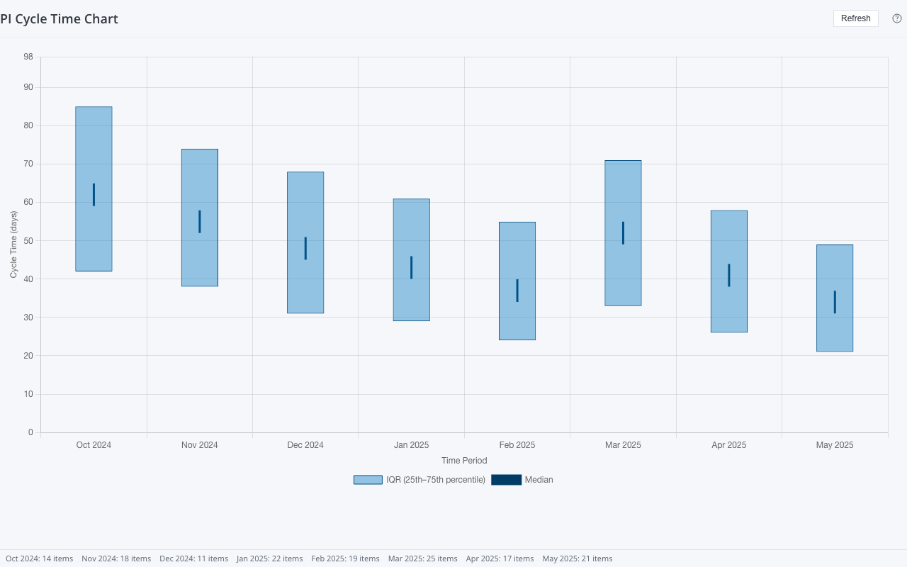

# PI Cycle Time Chart

A Rally Custom View widget that plots **Portfolio Item cycle time distributions** as column-and-whisker charts. Each time bucket shows the median cycle time (horizontal tick) with the 25th–75th percentile interquartile range (bar). Cycle time = `ActualEndDate − ActualStartDate` in calendar days.



Broadcom endorsed widget spec: [github.com/Broadcom/rally-widgets/tree/main/endorsed-widgets/pi-cycle-time-chart](https://github.com/Broadcom/rally-widgets/tree/main/endorsed-widgets/pi-cycle-time-chart)

Built with React 18, TypeScript 5, and [`@customagile/widget-ai`](https://github.com/CustomAgile/widget-ai).

---

## What it does

- Queries Portfolio Items (Feature, Epic, or Initiative) that have both `ActualStartDate` and `ActualEndDate` recorded
- Groups items into time buckets by the `ActualEndDate` (month, quarter, or year)
- Computes per-bucket statistics: median, 25th percentile, 75th percentile, and item count
- Renders a Chart.js bar chart with IQR floating bars and a median scatter overlay
- Shows a warning banner when the 2,000-item fetch cap is hit
- Supports an optional WSAPI query filter for advanced scoping

The widget respects Rally navigation scope (project and child project settings) but does NOT respond to timebox View Filters — scope is driven entirely by settings.

---

## Quick Start

```bash
npm install        # install dependencies
npm run dev        # start dev server on http://localhost:5173
```

Open http://localhost:5173 — the widget loads in mock mode with 8 months of sample data. No Rally connection needed to start.

---

## Settings (Edit Mode)

| Setting | Type | Default | Description |
|---------|------|---------|-------------|
| **Portfolio Item Type** | select | Feature | Which level of the PI hierarchy to analyze |
| **Bucket By** | select | Month | X-axis grouping: Month, Quarter, or Year |
| **Number of Buckets** | number | 10 | How many most-recent time periods to display |
| **Query** | text | _(empty)_ | Optional WSAPI filter (e.g. `(State = "Accepted")`) |

---

## Prerequisites

### Node.js

Node.js 18+ is required. Download from [nodejs.org](https://nodejs.org/).

### GitHub Packages Authentication

The `@customagile/widget-ai` package is hosted on GitHub Packages. You need a one-time setup to authenticate.

**Step 1 — Create a GitHub Personal Access Token:**

1. Go to https://github.com/settings/tokens/new
2. Give it a name (e.g. "widget-ai")
3. Select the `read:packages` scope
4. Generate and copy the token

**Step 2 — Add it to your global `.npmrc`:**

| OS | File location |
|----|---------------|
| macOS | `/Users/<username>/.npmrc` |
| Windows | `C:\Users\<username>\.npmrc` |

Create the file if it doesn't exist. Add these two lines:

```
@customagile:registry=https://npm.pkg.github.com
//npm.pkg.github.com/:_authToken=ghp_your_token_here
```

Once configured, `npm install` will work for all `@customagile/*` packages.

---

## Scripts

| Command | What it does |
|---------|-------------|
| `npm run dev` | Start Vite dev server (mock mode). Add `?live=true` for Rally data. |
| `npm run build` | Production build → `dist/app.js`. IIFE for Rally Custom Views. |
| `npm run build:mock` | Production build with mock data baked in. |
| `npm run typecheck` | TypeScript type checking without emitting files. |
| `npx widget-ai deploy` | Build and deploy to Rally as a Custom View. Requires `auth.json`. |

---

## Connecting to Rally (Live Data)

1. Create `auth.json` in this directory:

```json
{
  "server": "https://rally1.rallydev.com",
  "apiKey": "your-rally-api-key"
}
```

2. Start the dev server: `npm run dev`
3. Visit http://localhost:5173?live=true

The dev server proxies `/slm/*` requests to Rally using the API key. `auth.json` is gitignored.

---

## Project Structure

```
pi-cycle-time-chart/
├── src/
│   ├── App.tsx            ← chart + EditMode settings panel
│   ├── main.tsx           ← entry point, mock/live branching
│   ├── types.ts           ← PiCycleTimeSettings, BucketStats, DataProvider
│   ├── data-provider.ts   ← createRallyProvider (live WSAPI queries)
│   └── mock-data.ts       ← mockProvider, mockContext
├── docs/
│   └── setup-guide.md     ← detailed setup and deployment guide
├── dist/                  ← build output (gitignored)
├── auth.json              ← Rally credentials (gitignored, you create this)
├── rally.config.json      ← widget name, version, build settings
├── vite.config.js         ← build and dev server configuration
├── index.html             ← HTML shell
├── package.json
├── tsconfig.json
└── README.md
```

---

## Chart Approach

The chart uses Chart.js 4.x with:

- **X-axis:** `type: 'category'` with string bucket labels — no date adapter required
- **Y-axis:** `type: 'linear'` with cycle time in days
- **IQR box:** floating `bar` dataset using `[p25, p75]` format (Chart.js 4.x built-in)
- **Median tick:** `scatter` dataset with a wide horizontal `pointStyle: 'line'` marker

This avoids the Chart.js `type: 'time'` missing-adapter error entirely.

---

## Getting Help

- **Broadcom spec:** [pi-cycle-time-chart](https://github.com/Broadcom/rally-widgets/tree/main/endorsed-widgets/pi-cycle-time-chart)
- **Rally WSAPI docs:** [Broadcom TechDocs](https://techdocs.broadcom.com/us/en/ca-enterprise-software/valueops/rally/rally-help/reference/rally-web-services-api.html)
- **widget-ai:** See `docs/setup-guide.md` for full setup and deployment details
